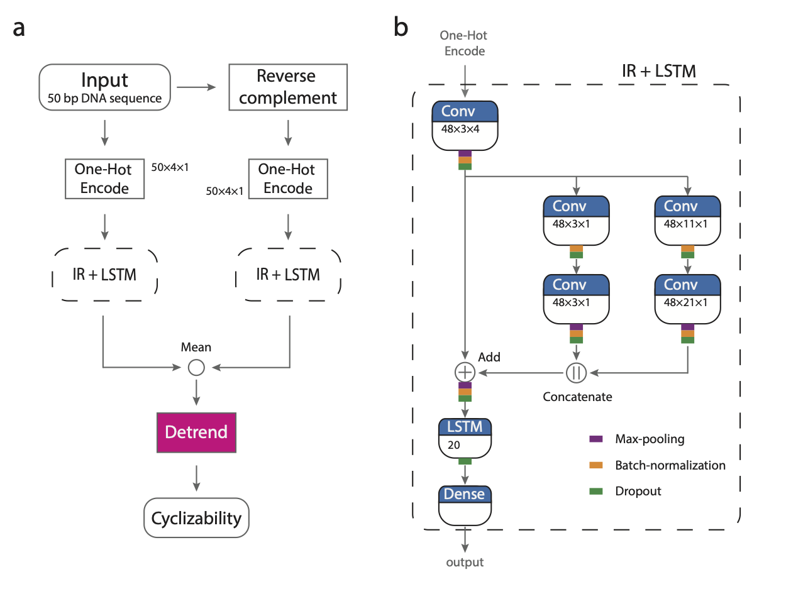

DNAcycP Python package 
================

**Maintainer**: Ji-Ping Wang, \<<jzwang@northwestern.edu>\>; Keren Li, \<<keren.li@northwestern.edu>\>

**Cite DNAcycP package**:

Li, K., Carroll, M., Vafabakhsh, R., Wang, X.A. and Wang, J.-P., DNAcycP: A Deep Learning Tool for DNA Cyclizability Prediction, 2021

## What is DNAcycP?

**DNAcycP**, short for **DNA** **cyc**lizablity **P**rediction, is a Python package to accurate predict DNA intrinsic cyclizablity score. It was built upon a deep learning architecture with a hybrid of Inception and Residual network structure and an LSTM layer. DNAcycP was trained based on loop-seq data from Basu et al 2021 (see below) and the predicted score, termed **C-score** achieves high accuracy compared to the experimentally measured cyclizablity score by loop-seq.

## Available format of DNAcycP

DANcycP is available in two formats: A web server available at http://DNAcycP.stats.northwestern.edu for real-time prediction and visualization of C-score up to 20K bp, and a standalone Python package available for free download from https://github.com/jipingw/DNAcycP. 


## Architecture of DNAcycP

DNAcycP takes the one-hot encoding of every 50 bp DNA sequence and its reverse complement as input. The core of DNAcycP is a deep learning architecture pipeline mixed with Inception-ResNet structure and an LSTM layer (IR+LSTM, Fig 1b) that processes the sequence and its reverse complement separately, the results from which are averaged and detrended to reach the predicted intrinsic score. (Fig 1a).

IR+LSTM starts with a convolutional layer for dimension reduction such that the encoded sequence space is reduced from 2D to 1D. The output is fed into an inception module that contains two parallel branches, each having two sequentially connected convolutional layers with branch-specific kernels to capture sequence features of different scale. The first branch has kernel dimension 3x1 for both layers and the second has kernel dimension 11x1 and 21x1 sequentially. The output of the inception module is combined by concatenation and added back to the input of the inception module to form a short circuit or residual network. Finally, the IR+LSTM concludes with a dense layer to predict output with linear activation function. 



## DNAcycP required packages

1. `tensorflow 2.7.0`
2. `keras 2.7.0`
3. `pandas 1.3.5`
4. `numpy 1.21.5`

## Usage

DNAcycP supports the input sequence in two formats: FASTA format (with sequence name line beginning with “>”) or plain TEXT format. Unlike in the webserver version where only one sequence is allowed in input for prediction, the Python package allows multiple sequences in the same input file. In particular for the TEXT format, each line (can be of different length) in the file is regarded as one input sequence for prediction. 

The main funciton in DNAcycP is `dancycp.py` which carries two arguments:

  * `-i`: input file name
  * `-b`: prediction output file name base
  * `-t`: this option indicates input file in TEXT format

Example 1:

```bash
python3 dnacycp.py -i ex1.fasta -b ex1
```

`-i` specifies input file named "ex1.fasta". Without `-t` option, the input file is regarded as in FASTA format. The predicted C-score will be saved in files, one for each sequence with two columns named `Position` and `C-score`. The output file will be named as "eb1_cyc_1.txt", "eb1_cyc_2.txt"..., for the first, second sequence etc. 


Example 2:

```bash
python3 dnacycp.py -i ex2.txt -b ex2 -t
```

With `-t` option, the input file is regarded as in TEXT format, each line representing one sequence.
The predicted C-scores will be saved in one file, with C-scores in each line corresponding to the sequence in the input file in the same order.

For any input sequence, DNAcycP predicts the C-score for every 50 bp. Regardless of the input sequence format the first C-score in the output file corresponds to the sequence from position 1-50, second for 2-51 and so forth.


## Other References

* Basu, A., Bobrovnikov, D.G., Qureshi, Z., Kayikcioglu, T., Ngo, T.T.M., Ranjan, A., Eustermann, S., Cieza, B., Morgan, M.T., Hejna, M. et al. (2021) Measuring DNA mechanics on the genome scale. Nature, 589, 462-467.


